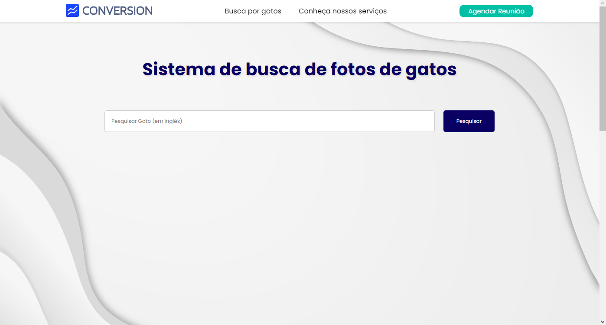
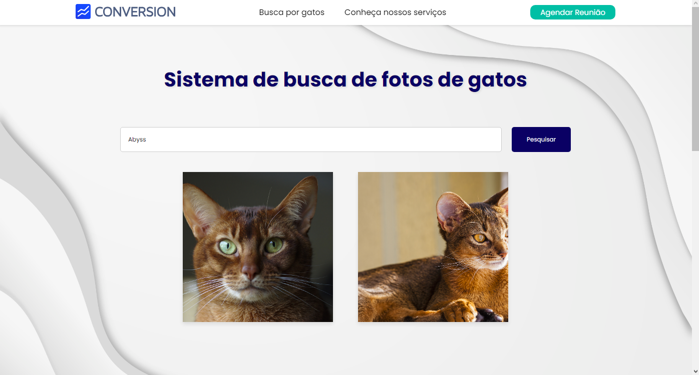

<h1 align="center">:file_cabinet: Buscador de Fotos de Gatos</h1>

## :memo: Descrição
Sistema de busca de fotos de gatos desenvolvido como parte de um teste técnico para vaga de estágio de Desenvolvedor na empresa Conversion.

## :books: Funcionalidades
* **Funcionalidade**: O site é alimentado por uma API que permite pesquisar fotos de gatos com base na raça digitada. É importante lembrar que a pesquisa deve ser feita em inglês.

## :wrench: Tecnologias Utilizadas
* React.js
* HTML5
* CSS
* JavaScript
* API "The Cat API"

## :camera: Capturas de Tela

## :soon: Implementação Futura
* Integração com mais fontes de dados de gatos.
* Melhorias na interface do usuário.
* Adição de funcionalidades de favoritos e compartilhamento.

## :handshake: Colaboradores
<table>
  <tr>
    <td align="center">
      <a href="https://github.com/armandomonteir-o">
         
        
          <b>Armando Monteiro</b>
        
      </a>
    </td>
  </tr>
</table>

## :dart: Status do Projeto
* Concluído. (Poderá ser atualizado no futuro com novas funcionalidades)
